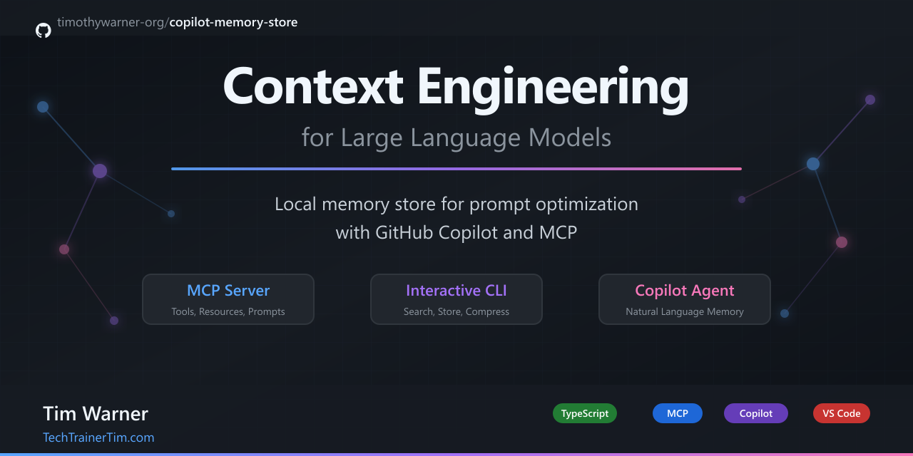

# Copilot Memory Store



A **local JSON memory store** for context engineering with GitHub Copilot and MCP clients.

## Documentation

| Guide | When to read |
|-------|--------------|
| [docs/CODE_WALKTHROUGH.md](docs/CODE_WALKTHROUGH.md) | Architectural overview with flow diagrams |
| [docs/CLI_GUIDE.md](docs/CLI_GUIDE.md) | Interactive REPL command reference |
| [docs/COPILOT_GUIDE.md](docs/COPILOT_GUIDE.md) | Using the memory tools from GitHub Copilot |

## Features

- **CLI** (`memory>`) - Interactive REPL for managing memories
- **MCP Server** - Stdio server exposing tools, resources, and prompts
- **Custom VS Code Agent** - Pre-configured "Memory" agent for natural language usage
- **Context Compression** - Budget-constrained context injection with optional LLM summarization
- **Auto-Keywords** - Automatic keyword extraction for improved search relevance

## Why This Exists

LLMs have limited context windows. This tool helps you:

1. **Store** important information as searchable memories with auto-extracted keywords
2. **Search** memories by relevance scoring (keywords + tags + recency)
3. **Compress** relevant memories into a character budget for context injection

Perfect for teaching **context engineering** - the art of fitting the right information into limited LLM context.

## Quick Start

```bash
# Install dependencies
npm install

# Copy environment config (tweak MEMORY_PATH / DeepSeek settings as needed)
cp .env.example .env

# Build the project
npm run build

# Run the CLI
npm run dev

# Or run the MCP server
npm run mcp

# Debug presets live in `.vscode/launch.json` (Run → Start Debugging → pick a config)
```

> **Heads-up:** `project-memory.json` contains a few demo memories for workshops. Delete it (or point `MEMORY_PATH` elsewhere) before your first real run if you want to start with an empty store.

## VS Code GitHub Copilot Integration

### 1. Build the project

```bash
npm run build
```

### 2. Configure MCP server

The project includes a pre-configured `.vscode/mcp.json`:

```json
{
  "servers": {
    "copilot-memory": {
      "type": "stdio",
      "command": "node",
      "args": ["./dist/mcp-server.js"],
      "env": {
        "MEMORY_PATH": "project-memory.json"
      }
    }
  }
}
```

Run `npm run build` whenever you change the server so the compiled `dist/mcp-server.js` stays current.

### 3. Use the Memory Agent (Recommended)

The project includes a custom **Memory agent** at `.github/agents/memory-agent.agent.md` that makes using the memory tools natural.

**To use:**

1. Open Copilot Chat in VS Code
2. Click the agent dropdown (shows "Agent", "Ask", etc.)
3. Select **"Memory"**
4. Chat naturally!

**Example conversations:**

```text
You: Remember that I prefer functional components over class components
Agent: [Calls memory_write] Saved your preference for functional React components.

You: What preferences do I have stored?
Agent: [Calls memory_search] Based on your stored memories, you prefer...

You: Help me refactor auth.ts
Agent: [Calls memory_search first for context] I found some relevant context about your authentication preferences...
```

### 4. Direct Tool References (Alternative)

You can also reference tools directly with `#`:

```text
#memory_write text: "We use PostgreSQL" tags: ["decision", "database"]
#memory_search query: "database"
```

### 5. Reload VS Code

After any configuration changes, reload VS Code:

- Press `Ctrl+Shift+P` (or `Cmd+Shift+P` on Mac)
- Run **"Developer: Reload Window"**

## MCP Server Features

### Tools (6)

| Tool | Description |
|------|-------------|
| `memory_write` | Add, save, store, or remember information to project memory |
| `memory_search` | Search, find, recall, or look up information from project memory |
| `memory_compress` | Create compact context from relevant memories within a budget |
| `memory_delete` | Soft-delete a memory (tombstone, recoverable) |
| `memory_purge` | Hard-delete by id, tag, or substring match |
| `memory_export` | Export all records as JSON |

### Resources (2)

| Resource | URI | Description |
|----------|-----|-------------|
| `stats` | `memory://stats` | Live statistics (counts, top tags) |
| `recent` | `memory://recent` | Last 10 memories added |

### Prompts (3)

> **Note:** VS Code GitHub Copilot does not currently support MCP prompts. Use the MCP Inspector or other MCP clients to test prompts.

| Prompt | Description |
|--------|-------------|
| `summarize-memories` | Generate a summary of memories on a topic |
| `remember-decision` | Structured template for architectural decisions |
| `inject-context` | Auto-inject relevant memories as context for a task |

## Configuration

Edit `.env`:

```env
# Required: where memories are stored
MEMORY_PATH=.copilot-memory.json

# Optional: for LLM-assisted compression
DEEPSEEK_API_KEY=your-key-here
DEEPSEEK_BASE_URL=https://api.deepseek.com
DEEPSEEK_MODEL=deepseek-chat
```

The MCP configuration in `.vscode/mcp.json` points at `project-memory.json` so you can ship a pre-filled sample store. Override `MEMORY_PATH` in your environment if you want the CLI and MCP server to share a different file.

## MCP Inspector

Debug and test the MCP server interactively:

```bash
# Launch inspector (opens web UI)
npm run inspect

# Or with live TypeScript reloading
npm run inspect:dev
```

The inspector lets you:

- Browse all tools, resources, and prompts
- Execute tools and see responses
- View raw JSON-RPC message traffic

## CLI Commands

See [docs/CLI_GUIDE.md](docs/CLI_GUIDE.md) for detailed usage and examples.

| Command | Description |
|---------|-------------|
| `add [--tags a,b] <text>` | Add a memory |
| `search <query> [--limit N] [--raw]` | Search memories |
| `compress <query> [--budget N] [--llm]` | Compress for context |
| `delete <id>` | Soft-delete |
| `purge --id/--tag/--match` | Hard-delete |
| `export` | Dump JSON |
| `stats` | Show statistics |

## Context Engineering Demo

The `memory_compress` tool demonstrates key context engineering concepts:

1. **Relevance Scoring** - Memories ranked by keyword matches + tag matches + recency
2. **Budget Constraints** - Fit context into character limits (200-8000 chars)
3. **Deterministic Compression** - Predictable truncation without LLM
4. **LLM-Assisted Compression** - Optional DeepSeek summarization for smarter compression

## Architecture

```text
.github/
├── agents/
│   └── memory-agent.agent.md  # Custom VS Code agent definition
└── copilot-instructions.md    # Onboarding for AI coding agents
.vscode/
├── launch.json
├── mcp.json
└── settings.json
docs/
├── CODE_WALKTHROUGH.md   # Architecture walkthrough + diagrams
├── CLI_GUIDE.md          # CLI usage guide
└── COPILOT_GUIDE.md      # VS Code Copilot usage guide
src/
├── cli.ts                # Interactive REPL
├── mcp-server.ts         # MCP stdio server (tools, resources, prompts)
├── memoryStore.ts        # Core storage, search, compression
└── deepseek.ts           # Optional LLM compression
```

## npm Scripts

| Script | Description |
|--------|-------------|
| `npm run dev` | Run CLI with tsx (dev mode) |
| `npm run build` | Compile TypeScript to dist/ |
| `npm run mcp` | Run MCP server with tsx |
| `npm run inspect` | Launch MCP Inspector |
| `npm run inspect:dev` | Inspector with tsx (live reload) |

## Development Workflow

| Task | Recommended action |
|------|--------------------|
| Edit + run CLI locally | `npm run dev` or VS Code "CLI (TypeScript via tsx)" debug config |
| Serve MCP tools to Copilot | `npm run mcp` during development; rebuild with `npm run build` for the dist-based config |
| Explore MCP surface area | `npm run inspect` or `npm run inspect:dev` |
| Update docs/instructions | Keep [docs/](docs) and [.github/copilot-instructions.md](.github/copilot-instructions.md) in sync |

## External Resources

- [VS Code Custom Agents](https://code.visualstudio.com/docs/copilot/customization/custom-agents)
- [VS Code MCP Servers](https://code.visualstudio.com/docs/copilot/customization/mcp-servers)
- [MCP Specification](https://modelcontextprotocol.io/specification/)
- [MCP TypeScript SDK](https://github.com/modelcontextprotocol/typescript-sdk)
- [MCP Inspector](https://github.com/modelcontextprotocol/inspector)

## Author

**Tim Warner**

- [Website](https://techtrainertim.com)
- [GitHub](https://github.com/timothywarner)
- [LinkedIn](https://www.linkedin.com/in/timothywarner/)
- [YouTube](https://www.youtube.com/channel/UCim7PFtynyPuzMHtbNyYOXA)
- [Bluesky](https://bsky.app/profile/techtrainertim.bsky.social)
- [Mastodon](https://mastodon.social/@techtrainertim)

## License

MIT
