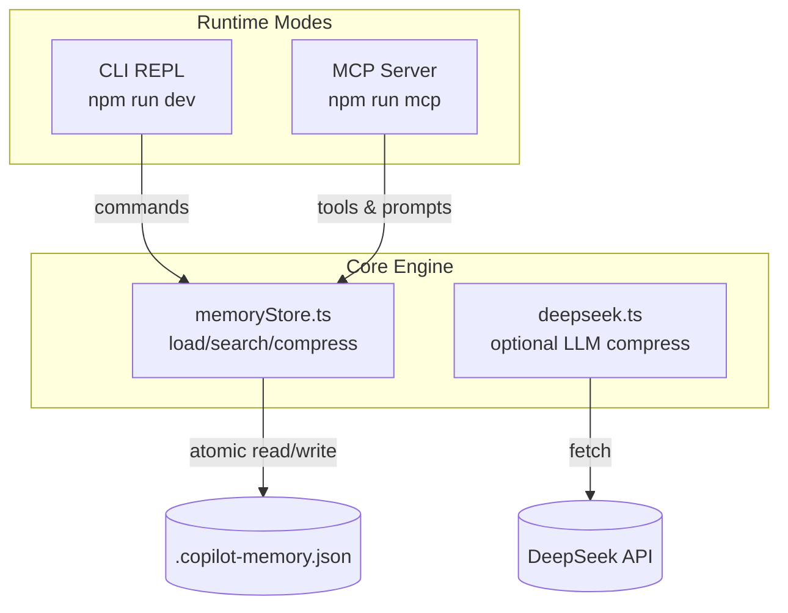
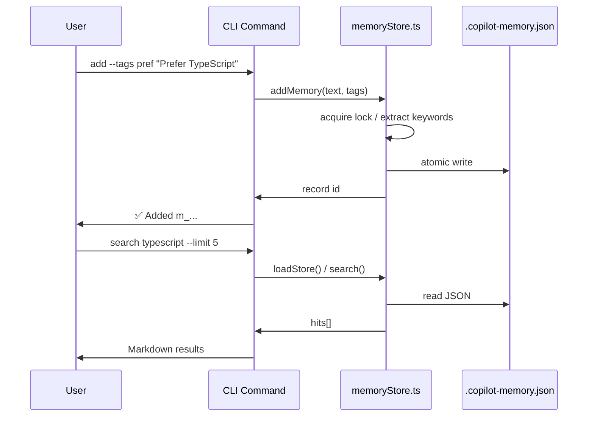

# Copilot Memory Store — Code Walkthrough

## High-Level Snapshot
- **Purpose**: Persist user memories locally, score them for relevance, and deliver context back to LLM agents via CLI or MCP.
- **Runtime**: TypeScript (ESM, async/await) executed with `tsx` in dev or Node on the built JS.
- **Key Entry Points**: CLI REPL ([src/cli.ts](src/cli.ts)) and MCP stdio server ([src/mcp-server.ts](src/mcp-server.ts)).
- **Single Source of Truth**: All storage/search/compression logic lives in [src/memoryStore.ts](src/memoryStore.ts).

## Core Module Tour
- [src/memoryStore.ts](src/memoryStore.ts) handles:
	- File locking (lock file per store) to prevent concurrent writes.
	- Keyword extraction + relevance scoring used by both CLI and MCP.
	- Deterministic compression that emits Markdown within a character budget.
- [src/deepseek.ts](src/deepseek.ts) provides the optional LLM compression step; only runs when `--llm` is requested and `DEEPSEEK_API_KEY` is present.
- [src/cli.ts](src/cli.ts) wraps the core APIs in REPL commands; it reloads the store before every command to avoid stale reads.
- [src/mcp-server.ts](src/mcp-server.ts) exposes tools/resources/prompts for GitHub Copilot Agent mode using `@modelcontextprotocol/sdk`.

## Execution Flow (CLI)

## Execution Flow (MCP Server)
- `npm run mcp` uses `tsx` to run [src/mcp-server.ts](src/mcp-server.ts).
- Server registers tools (`memory_write`, `memory_search`, etc.), resources (`memory://stats`, `memory://recent`), and prompts.
- Each tool:
	1. Validates input with `zod` schemas.
	2. Reads or mutates the store via functions in [src/memoryStore.ts](src/memoryStore.ts).
	3. Returns structured text payloads; all logging goes to stderr via `log()`.
- Compression tool optionally calls [src/deepseek.ts](src/deepseek.ts) when `llm=true`.

## Data Model @ [src/memoryStore.ts](src/memoryStore.ts)
- `MemoryRecord`: `{ id, text, tags, keywords, createdAt, updatedAt, deletedAt }`.
- `loadStore()` resolves `MEMORY_PATH` env override, reads JSON (default `.copilot-memory.json`).
- `addMemory()` normalizes tags, extracts keywords, writes atomically, and returns the record.
- `search()` filters out tombstoned records and applies token-based scoring (text hits + tag bonus + keyword bonus + recency).
- `compressDeterministic()` formats hits into Markdown and truncates within the caller’s `budget`.

## Running & Debugging
- **Install**: `npm install` (installs `@modelcontextprotocol/sdk`, `tsx`, TypeScript).
- **CLI REPL**: `npm run dev` → watch output in the Git Bash integrated terminal.
- **Build**: `npm run build` (emits ESM to `dist/`).
- **MCP Server**: `npm run mcp` (development) or `npm run mcp:dist` after building.
- **Inspector**: `npm run inspect` (against compiled JS) or `npm run inspect:dev` (live TypeScript) to explore tools/resources visually.
- **VS Code Debugging**: choose a launch preset (CLI or MCP) in [.vscode/launch.json](.vscode/launch.json).

## Environment & Configuration
- Copy `.env.example` to `.env` before running; key knobs:
	- `MEMORY_PATH` to point at an alternate JSON file (e.g., `project-memory.json` used in samples).
	- `MEMORY_LOCK_PATH` if you need lock files elsewhere.
	- `DEEPSEEK_*` settings to enable the LLM compression path.
- `.copilot-memory.json` is git-ignored—each learner gets their own memory store.

## Teaching Tips
- Emphasize that **all behaviors** (CLI, MCP, future UIs) should call into [src/memoryStore.ts](src/memoryStore.ts) rather than reimplementing file I/O.
- Show how adding tags improves `search()` scoring, then demonstrate `compressDeterministic()` to illustrate context budgeting.
- Have students compare deterministic vs. DeepSeek compression by toggling `--llm`.
- Encourage using MCP prompts (e.g., `summarize-memories`) to automate context workflows from Copilot Chat.
